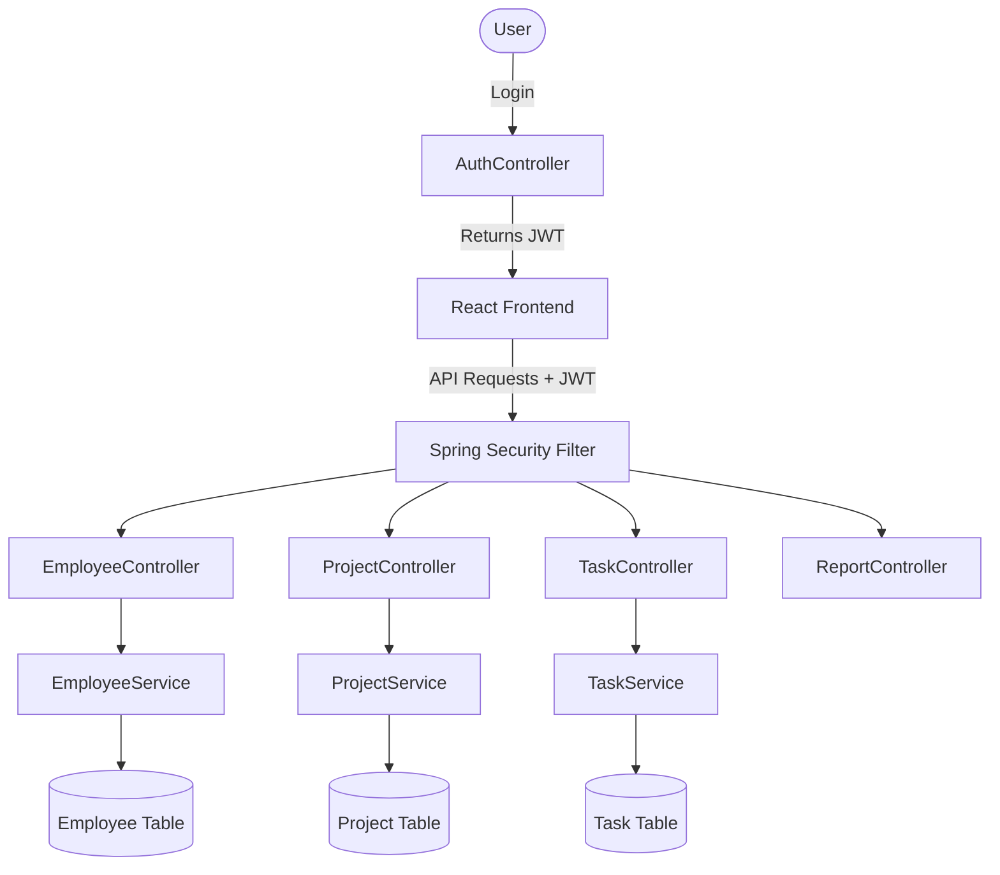

# Smart Employee & Project Management System

## Overview
This is a Full Stack web application built using ReactJS (Frontend) and Spring Boot (Backend). It includes Authentication (JWT, Role-based), Employee Management, Project Management, Task Management, Dashboard, and Reports.

## Flowchart


## Setup Instructions

### Backend (Spring Boot)
1. Ensure Java 17+ and Maven are installed.
2. Configure MySQL. Update `employee/src/main/resources/application.properties` with your database credentials.
3. Run the SQL script `database_script.sql` to initialize tables.
4. Open a terminal in the `employee` directory and run:
   ```bash
   mvn spring-boot:run
   ```
5. The backend will start on `http://localhost:8080`.

### Frontend (ReactJS)
1. Ensure Node.js is installed.
2. Open a terminal in the `src/Emp React` directory.
3. Install dependencies:
   ```bash
   npm install
   ```
4. Start the Vite development server:
   ```bash
   npm run dev
   ```
5. The frontend will start on `http://localhost:5173`.

### Default Credentials
- A default admin user can be created by registering an account with Role="Admin" in the Sign-Up page.

## Features Added
- **Authentication**: JWT, Role-based access (Admin/Employee).
- **Employee Management**: CRUD operations, Search, Pagination.
- **Project Management**: Create/Update/Delete projects, Assign employees, Manage Status/Priority.
- **Task Management**: Create/Assign tasks, Update progress, Status, Remarks.
- **Reports**: Generate Employee-wise Task reports in CSV format.
